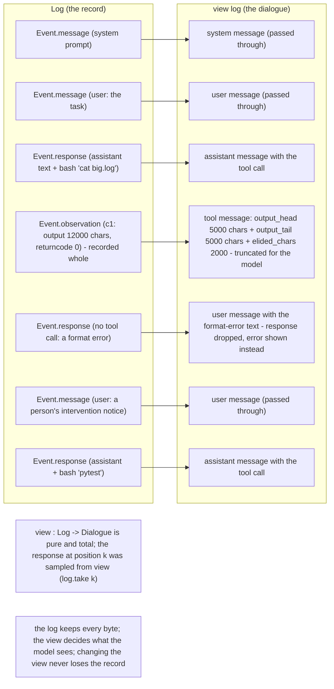
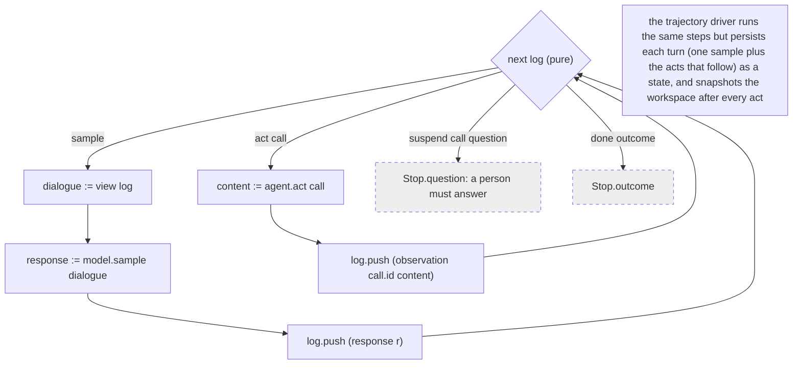

# Agent API

`Alaya.Agent` is the smallest set of operations a trajectory needs from an agent. It knows
nothing about providers, tools, or environments. Everything that is specific to an agent —
its prompts, its tools, how it reads a response, how it shows a tool's output — lives in the
agent; everything that is about persistence, branching, and people lives in the trajectory.
`Alaya.Agent.MiniSwe` is one agent; `docs/trajectory-schema.md` is the one driver.

## 1. Two worlds, one record

**Problem.** An agent talks to a stochastic model and acts on an effectful environment. To
replay, branch, or audit a run, everything that happened has to be recorded — yet what the
model is shown is not what happened: tool output is truncated, a malformed turn is replaced by
an error message, a person's note is wrapped in an envelope. Recording only what the model saw
loses the facts; recording only the facts loses the ability to reproduce the request.

**How it works.** The agent keeps a **log** of events, verbatim, and a pure **view** function
projects the log onto the **dialogue** the model is conditioned on. Both are kept: the log is
the record, the view is a function of it.

```lean
inductive Event where
  | message (message : Chat.Message)              -- placed verbatim: prompts, a person's note
  | response (response : Chat.Response)           -- the model's turn, whether or not it parsed
  | observation (callId : String) (content : Json) -- a tool call's result, as the agent produced it

abbrev Log := Array Event
abbrev Dialogue := Array Chat.Message
abbrev View := Log -> Dialogue
```

## 2. The view

**Problem.** Four things routinely differ between what happened and what the model should see:

- a tool printed 12 000 characters and the model should see 10 000 of them;
- the model's turn had no tool call, and mini's protocol replaces it with an error message the
  model reads as a user turn;
- an old observation is no longer worth its tokens and a policy elides it;
- a state recorded before the log existed holds only rendered messages.

Handling these at recording time bakes one policy into the data forever. Handling them in the
view keeps the data whole and makes the policy a parameter.

**How it works.** `view : Log -> Dialogue` is pure and total. Its domain is the whole log, not a
single event, because "elide observations older than N turns" needs position and "stay under a
token budget" needs everything. One rule keeps it pure: anything non-deterministic — a
model-written summary, say — is itself an event in the log, and the view merely places it.

The invariant every driver keeps: **the response at log position k was sampled from
`view (log.take k)`**. Because the view is pure and the log is persisted, the exact request the
model saw at any step is recomputable, and nothing about it needs to be stored.

*How the pure `view` function projects the recorded log into the dialogue sent to the model.*



What this buys:

- **Replay is exact.** The model cache is keyed by the request, which is `view log`. Same log,
  same view, same key. Changing the view is a new experiment, and it never touches the record.
- **Reports can show both.** `alaya show HASH --view` prints the log and then the view; the HTML
  report shows each state's events and, on demand, the request the model is sent from it.
- **Old data stays valid.** A version-1 state's rendered messages load as `Event.message`, which
  every view passes through unchanged, so an old forest still grows.

## 3. Directives: control from the log alone

**Problem.** Who decides whether to sample, act, or stop must not depend on hidden state, or a
resumed run would behave differently from the run it continues.

**How it works.** `next : Log -> Directive` is pure and total, and the four directives are all a
driver ever does:

```lean
inductive Directive where
  | sample                                          -- draw the next response from view log
  | act (call : Chat.ToolCall)                      -- run one tool call
  | suspend (call : Chat.ToolCall) (question : String)  -- stop; a person must answer
  | done (outcome : Outcome)                        -- the run is over
```

Everything `next` needs is derivable from the log, and `Alaya.Agent.Log` gives the common
derivations: `responses` (how many turns so far, for a step limit), `lastResponse?`,
`sinceLastResponse` (the events of the current turn), and `pending` (the last response's tool
calls that no observation has answered yet). A mini agent counts consecutive format errors by
re-parsing the trailing responses; a step limit is a count of response events. Nothing is
stored beside the log.

`suspend` is how an agent asks a person something. The driver records the question and stops;
the person's answer arrives later as the observation of the asking call, and the log continues
as if the tool had returned. The mini port does not offer such a tool, but the trajectory
handles the directive for agents that do.

## 4. Acting

**Problem.** Tool results have to be durable and branchable, but the agent should not have to
know how.

**How it works.** `act : Chat.ToolCall -> Result Json` runs one call against whatever
environment the agent closed over and returns the observation content to record. Its shape is
the agent's to define — mini records `{output, returncode, exception_info}` — and the view is
what renders it. The driver snapshots the working directory after every act, so a state's
workspace is exactly the one its last observation left behind. An agent that fails to execute
a call should return an observation saying so, not throw: a run must not die on a spawn error.

## 5. The agent record and the reference loop

```lean
structure Agent where
  identity : Lean.Json                   -- who this is and how it is configured, for provenance
  tools : Array Chat.ToolDefinition      -- offered on every sample
  view : View
  next : Log -> Directive
  act : Chat.ToolCall -> Result Lean.Json
```

`Agent.run agent sample log` is the reference loop: follow `next` until it stops, sampling from
`view log` and pushing every event. It returns the final log and a `Stop`: an `outcome`, or a
`question` a person has to answer. A trajectory drives the same steps but persists each **turn**
— one sample and the acts that follow it — as a state, and snapshots after every act. Tests run
an agent through `Agent.run` with a scripted `sample` and no store at all.

*The reference loop `Agent.run`, and how a trajectory drives the same steps.*



## 6. Writing an agent

An agent is a value of `Agent`, so writing one is filling in five fields:

1. **`tools`.** The definitions sent with every request. Adding a tool changes every cache key,
   so a forest recorded with one tool list will not replay under another.
2. **`view`.** Decide, event by event or over the whole log, what the model sees. Pass
   `Event.message` through unchanged, so prompts, notices, and legacy messages behave.
3. **`next`.** Read the log. Use `Log.pending` to find unanswered calls; return `act` for the
   first, `done` when the run is over, `suspend` to ask a person, `sample` otherwise.
4. **`act`.** Run the call, return an observation. Never throw for an execution failure.
5. **`identity`.** Name the agent and the configuration that shapes `view` and `next`.

The test suite's `askingAgent` in `Test/Mini.lean` is the whole recipe in forty lines: mini's
`bash` plus an `ask_user` tool that suspends, driven by the trajectory with no change to it.
