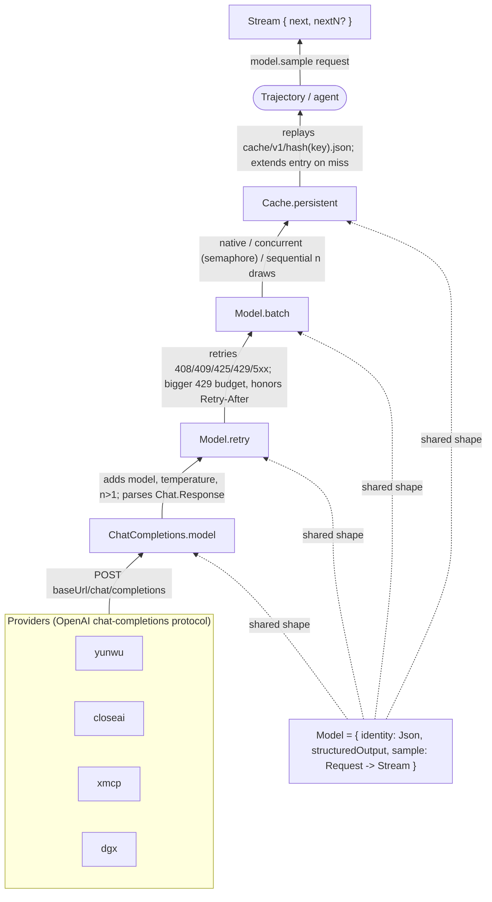
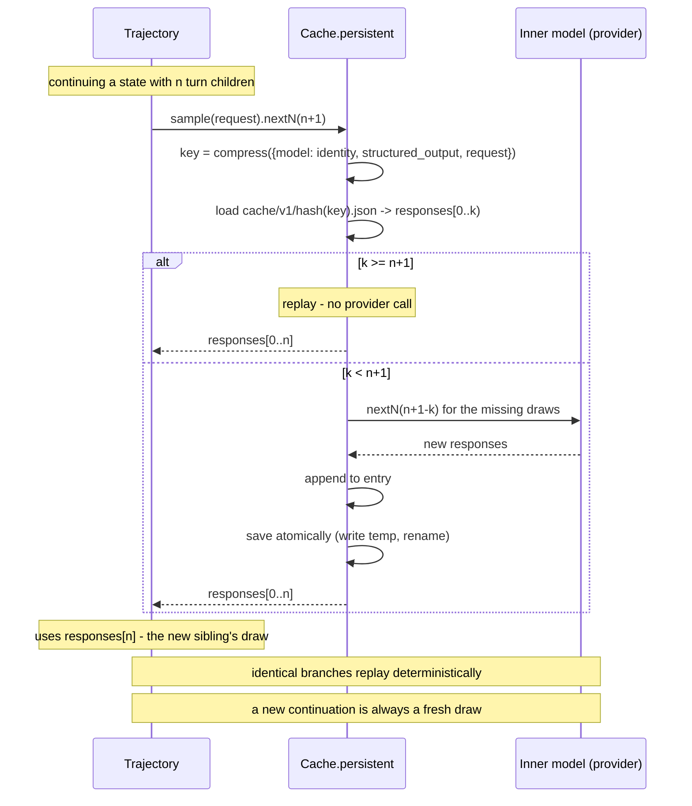

# LLM API

`Alaya.Model` gives every language model the same interface, and layers behaviour on top of it
by wrapping: retry, batching, sampling independence, and a persistent response cache. The
agent and the trajectory see one `Model` and never learn which layers are underneath.

## 1. The chat protocol

**Problem.** Providers speak dialects of one wire protocol, and the things an agent depends on
— tool calls, finish reasons, malformed arguments — are exactly where dialects differ.

**How it works.** `Alaya.Chat` fixes one typed protocol and converts at the edge.

| Type | What it holds |
| --- | --- |
| `Message` | `system`, `user`, `assistant (content?, toolCalls, reasoning?)`, `tool (callId, content)` |
| `ToolCall` | `id`, `name`, `arguments : Json`, and `invalidArguments?` — the raw string when the provider sent arguments that are not JSON |
| `ToolDefinition` | `name`, `description`, a `JsonSchema` for the parameters, or exact `parametersJson?` to reproduce a schema byte for byte |
| `Request` | `messages`, `tools`, `toolChoice`, `responseFormat` |
| `Response` | `content?`, `toolCalls`, `usage?`, `finishReason?`, `reasoning?`, and the provider's `raw` payload |

Two choices matter downstream. A tool call whose arguments do not parse is a *fact of the
protocol*, not a failure: models do emit them, so `Response.fromJson` records the raw string and
lets the agent decide what to do. And an assistant message carries the provider's
`reasoning_content` when there is one, because a thinking-mode provider requires it echoed back
on later turns.

Structured output has two modes, `StructuredOutput.native` (the provider enforces the schema) and
`markdownCodeFence` (the schema is appended to the last user message and the reply is parsed out
of a ` ```json ` fence); `Response.structured` validates either against the `JsonSchema`.

## 2. The model interface

**Problem.** An agent must be able to draw a *particular* response — the third sample of this
request, not a fresh one — so that runs replay and forks are well defined.

**How it works.**

```lean
structure Model where
  identity : Lean.Json                -- what makes a response reproducible: model name, temperature, options
  structuredOutput : Chat.StructuredOutput := .native
  sample : Chat.Request -> Result Model.Stream

structure Model.Stream where
  next : Result Chat.Response         -- the next draw
  nextN? : Option (Nat -> Result (Array Chat.Response))   -- several at once, when the layer can
```

`sample` returns a **stream** rather than a response: a request names a sequence of draws, and
`next` advances along it. `Model.cacheKey request` is the string that identifies that sequence,
`compress { model := identity, structured_output, request }`, so two models with the same
identity given the same request name the same draws. `identity` therefore has to include
anything that changes what the provider is sent — the model name, the temperature, and options
such as reasoning echo.

*The model stack: providers wrapped by retry, batch, and cache adapters, all sharing one interface.*



## 3. Providers and transport

**Problem.** Four providers, four credentials, one of them self-hosted on a moving address.

**How it works.** `Alaya.Provider.fromSpec "PROVIDER:NAME"` builds the bare transport model;
the name may contain colons, so only the first splits.

| Provider | Default endpoint | Key variable | Endpoint override |
| --- | --- | --- | --- |
| `yunwu` | `https://yunwu.ai/v1` | `YUNWU_API_KEY` | `YUNWU_BASE_URL` |
| `closeai` | `https://api.openai-proxy.org/v1` | `CLOSEAI_API_KEY` | — |
| `xmcp` | `https://llm.xmcp.ltd` | `XMCP_API_KEY` | — |
| `dgx` | `http://10.42.0.1:8000/v1` | `DGX_API_KEY`, default `EMPTY` | `DGX_BASE_URL`, or `--url`/`--port` |

A missing key is a configuration error, except for `dgx`, where `EMPTY` is the vLLM convention for
a server that needs no credential. `--url` accepts anything from a bare host to a full URL and
fills in `http`, port `8000`, and `/v1`; `--port` wins over a port inside `--url`; passing either
turns off the `DGX_BASE_URL` fallback.

`Provider.ChatCompletions` is the one transport. It serializes the request with
`Request.toJson`, adds `model` and `temperature` (and `n` for several draws), and POSTs it with
`curl` to `<baseUrl>/chat/completions` under a connect timeout of 30 s and a total timeout of 10
minutes. HTTP failures become `Error.http status body retryAfterMs?`, with `Retry-After` parsed
from the headers; curl failures become `Error.transport`.

**Reasoning echo.** DeepSeek's thinking mode rejects a tool-calling history whose assistant turns
lack `reasoning_content`, which is every turn another model wrote. With `--echo-reasoning` the
transport sends the recorded trace on the last two assistant turns and the empty string on every
other, which the provider accepts. Why a window: a trace runs to tens of kilobytes, and echoing
all of them made a twenty-turn request exceed half a megabyte and time out. The dialogue keeps
every trace; this only shapes the request. Both the flag and the window are part of `identity`.

## 4. Adapters

Each adapter takes a `Model` and returns a `Model`, so they compose in any order; the trajectory
uses provider → retry → batch → cache.

**`Model.retry config`.** Repeats a failed draw when the failure is transient. HTTP 408, 409, 425,
429, and 5xx are retried with capped exponential backoff and jitter; 429 draws on a separate,
larger budget and honours the server's `Retry-After`. Transport failures are opt-in
(`retryUnknownDelivery`), because a provider may have processed a request before the connection
died; the trajectory opts in, since for a sample a duplicate only costs the request, while an
aborted run costs the agent its container. Structured-output and malformed-response failures are
opt-in for the same reason: a bad schema fails forever.

**`Model.batch mode`.** How `nextN n` is served: `native` passes `n` to the provider,
`sequential` draws one at a time, `concurrent (maxInFlight?)` puts all requests in flight on
dedicated threads, bounded by a semaphore shared across the model's streams so fan-out cannot
saturate a provider into rate limiting.

**`Model.repeatable` and `Model.independent`.** In-process sampling independence. `repeatable`
memoizes draws per cache key, so two streams over the same request see the same sequence;
`independent` shares one stream per request key, so two callers split one sequence between them
and never see the same draw. They are how a consumer states which of the two it wants.

**`Cache.persistent config`.** Replays recorded draws from disk and extends the entry on a miss.
The entry for a key lives at `cache/v1/<hash key>.json` (Lean's generic `hash` of the key
string, not SHA-256) and holds every draw recorded so far. A stream over a request walks the
entry from index 0; `nextN n` returns cached draws and asks the inner model only for the missing
ones, then saves atomically. In `readOnly` mode a miss is an error, which is how a replay proves
it never called a provider. Concurrent streams in one process serialize extensions of the same
entry; a cache directory must not be written by two processes.

*A cache lookup by draw index: replay on a hit, a provider call for the missing draws on a miss.*



The consequence the trajectory builds on: the same identity, the same request, and the same
index always yield the same response, so a branch replays for free and a new draw is always a
fresh sibling. See `docs/trajectory-schema.md` for the entry format.

## 5. Errors

Every operation runs in `Result α := EIO Error α`. The classes decide what is retryable and how a
front end reports it.

| Class | Meaning |
| --- | --- |
| `configuration` | a local mistake: missing key, unknown provider, a state that cannot be continued |
| `transport` | the request may or may not have arrived |
| `http status body retryAfterMs?` | the provider answered with a failure |
| `provider` | a provider-specific failure that is none of the above |
| `protocol` | a payload that is not the chat protocol |
| `structuredOutput` | the reply did not satisfy the requested schema |
| `cache` | the response cache could not be read or extended |
| `storage` | the content-addressed store or a snapshot failed |
| `cancelled` | stopped on purpose |
