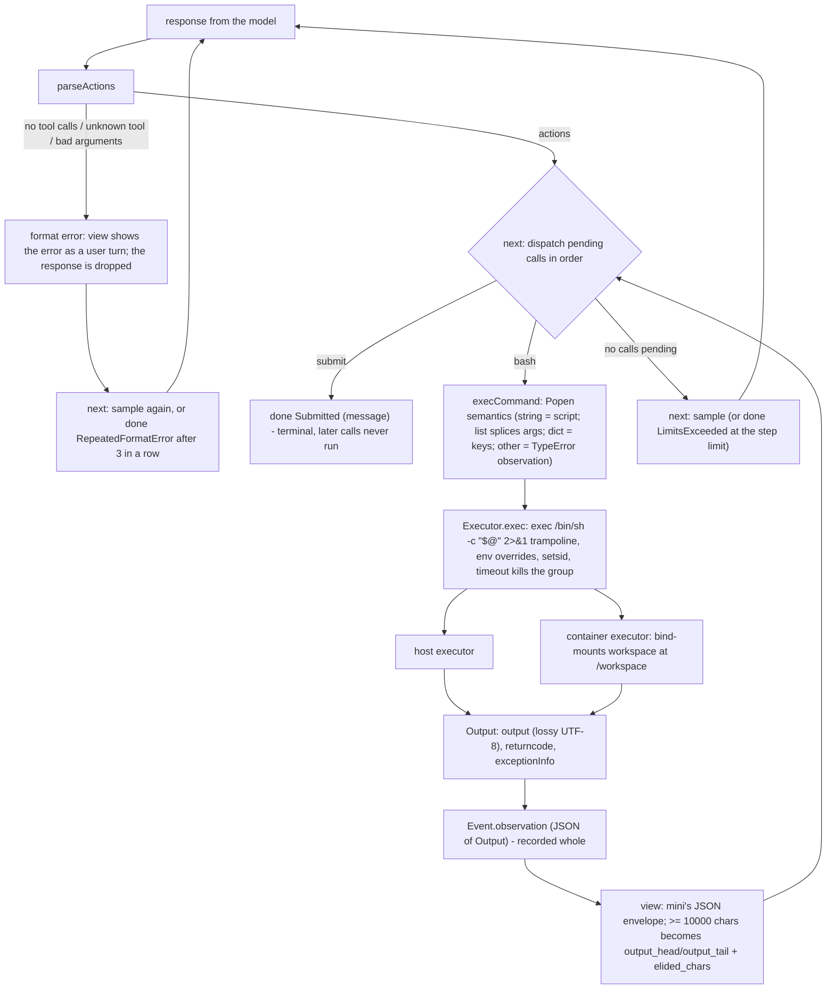

# MiniSwe design

`Alaya.Agent.MiniSwe` is a port of [mini-SWE-agent](https://github.com/SWE-agent/mini-swe-agent)'s
default tool-calling agent — `mini.yaml`, `litellm_model`, `actions_toolcall` — as an
`Alaya.Agent.Agent`. The goal is fidelity where the model can observe it: same prompts, same
tool schema, same parsing, same messages, same observation format, to the byte. Two things
differ, both because the trajectory keeps what happened apart from what the model sees, and
both are named below.

## 1. What is byte-identical

Golden fixtures in `Test/MiniFixtures.lean` are rendered by mini's own jinja templates, and the
tests compare the port's output to them character by character:

- the system prompt and the instance prompt, for both the Linux and the macOS variant (the
  macOS one adds a note about `sed -i ''`);
- the `bash` tool schema, mini's `BASH_TOOL` in strict mode (see §8);
- the observation envelope, including jinja's `tojson` escaping (`ensure_ascii`, and `<`, `>`,
  `&`, `'` as `\uXXXX`) and the truncation at 10 000 characters;
- the format-error messages, including the truncation notice for a response the provider cut
  off.

Where the port deliberately differs, the test applies the same substitution to the fixture and
checks the rest still matches (`portOf` in `Test/Mini.lean`).

## 2. Prompts

**Problem.** The instance prompt tells the model what machine it is on, and a model that is told
the wrong operating system uses the wrong `sed`.

**How it works.** `initialLog config uname` produces the two opening events: the system message
and the rendered instance message with the task and the `uname` line. The `uname` comes from the
**executor** — the host, or the image a container run is pinned to — because that is where the
commands will run. The opening log is frozen into the root state, so a continuation months later
still describes the machine the run is pinned to.

The only change to mini's text is the two sentences that name the submission sentinel, which
now name the `submit` tool (`miniSubmitInstruction` → `submitInstruction`). Everything else,
down to jinja's stripped trailing newline, is mini's.

## 3. Tools

**`bash`** is mini's: an object with one required string property, `command`. It is serialized
in strict mode, so the model sees mini's schema plus `"additionalProperties": false`.

**`submit`** is the port's, and it is the first deliberate deviation. Mini ends a run when a
command's output starts with the line `COMPLETE_TASK_AND_SUBMIT_FINAL_OUTPUT`: its environment
scans every command's output for the sentinel, and everything after that line is the
submission. That puts the end of the run inside a tool's output, which means whoever drives the
agent has to read and interpret observations. Here the driver is the trajectory, which treats
observations as opaque JSON by design, so the end of a run has to be visible in the log's
structure instead: the model calls `submit` with a `message` saying what it did, and `next`
returns `done` with that message as the submission. The prompt's two instructions and the closing hint of the format-error message say so.

The tool list is sent with every request, so this changes every cache key relative to a mini run
with the sentinel; a trajectory recorded before the change still loads, but continuing it asks
the provider anew.

## 4. Reading a response

**Problem.** Models emit turns with no tool call, unknown tools, and arguments that are not
JSON; mini turns each into a specific message and keeps going.

**How it works.** `parseActions` reproduces `parse_toolcall_actions`. A response with no tool
calls is a format error. Each call must have arguments that parse as JSON, name `bash` or
`submit`, and, for `bash`, carry a `command`; the first offender produces the error, and the
messages concatenate as in mini, where unparseable arguments read as `{}` and so also trip the
missing-command message. A `bash` action carries the raw JSON value of `command`, whatever its
type. When the provider reports that it cut the response off (`finish_reason` `length`, or
`tool_calls` with no calls), the format error is the truncation notice instead.

The consequences of a format error are mini's: the offending assistant turn is **not** shown to
the model, the error is shown as a user turn, and after `maxConsecutiveFormatErrors` in a row
(default 3) the run ends with `RepeatedFormatError`. In the port both live in the view and in
`next`: the response event is recorded as it was, the view substitutes the user turn, and `next`
counts trailing format-error responses by re-parsing them.

## 5. Running a command

**Problem.** Mini's environment is Python's `Popen(command, shell=True, stderr=STDOUT)` with a
timeout that kills the process group and output decoded with `errors="replace"`. Error messages,
line numbers, and the bytes of the output all depend on those details.

**How it works.** `Alaya.Executor` reproduces them. Every executor runs the argv through the
trampoline `exec /bin/sh -c "$@" 2>&1`, so the inner shell receives exactly mini's argv and its
diagnostics are byte-identical; stderr is merged at the file-descriptor level; stdin is
inherited; the inherited environment gets mini's overrides (`PAGER=cat`, `TQDM_DISABLE=1`, …);
the child runs in its own session so a timeout kills the whole group; output is decoded with
CPython's replacement rules. A failure to execute — a missing working directory, a spawn error, a
timeout — is an `Output` with `exceptionInfo`, never an exception, because mini never lets an
execution problem end a run.

`execCommand` reproduces one more thing: what `Popen` does when `command` is not a string. A
list is spliced into extra shell arguments, a dict contributes its keys, and anything else is
the `TypeError` text CPython would raise, as an observation.

Two executors implement this. `Executor.onHost` runs on the machine. `Executor.Docker.executor`
starts one container per run, bind-mounts the working directory at `/workspace`, and runs each
command with `docker exec`, using the image's `timeout(1)` when it has one and a host-side
deadline as a backstop. What differs, and is the port's second deviation: mini's environment
persists everything a command does, while a snapshot captures only the working directory, so an
install into the image's filesystem lasts for the run and is gone when a branch is resumed later.

## 6. The view

**Problem.** The model must see mini's observation format, and no more than 10 000 characters of
any output; the record must keep the whole output.

**How it works.** `view` maps events one to one. A message passes through. A response becomes
the assistant message it was, or, when it fails to parse, the format-error user turn. An
observation, which the agent records as the JSON of `Output`, becomes the tool message with
mini's envelope:

```
{
  "returncode": 0,
  "output": "…"
}
```

or, at 10 000 characters and above, `output_head` and `output_tail` of 5 000 characters each
with `elided_chars` and a warning. The truncation happens here and only here. `alaya show HASH
--view` prints both the log and the view for a state, which is the quickest way to see the
difference.

*One mini turn: `parseActions` classifies the response, then pending actions run one at a time through the executor until a submit or a limit ends the run.*



## 7. Control

`next config log` is `DefaultAgent.run` and `query` as a function of the log:

1. If the last response failed to parse: `done RepeatedFormatError` once the trailing run of
   format errors reaches the limit, otherwise sample again.
2. Otherwise take the last response's actions in order and find the first one no observation
   has answered. A `submit` there ends the run with `Submitted` and the message as the
   submission; a `bash` there is the next `act`. Calls after a `submit` in the same turn never
   run, as calls after mini's sentinel never ran.
3. When every action has been answered, sample — unless `stepLimit` is set and the log already
   holds that many responses, in which case `done LimitsExceeded`. Mini checks the limit before
   the model call, and so does this.

`act` runs a `bash` call through the executor and returns `Output.toJson`. It is never asked to
run `submit`: `next` ends the run first.

## 8. Deviations, complete list

- `submit` in place of the output sentinel, and the three sentences that name it.
- Tool schemas are strict: the `bash` schema carries `"additionalProperties": false`, which
  mini's does not.
- The environment is a snapshot of the working directory, not a persistent machine.
- The wire envelope always carries `tool_choice: auto`, `response_format: text`, and a
  temperature, which mini leaves implicit; no model behaviour depends on them.
- No litellm cost accounting, so `cost_limit` is not enforced.
- Two rare messages embed a Python error string the port cannot reproduce: JSON parse errors in
  tool arguments carry Lean's parser message, and spawn failures carry Lean's `IO.Error` text.
- `ensure_ascii` escapes astral characters as surrogate pairs, as Python does; non-ASCII bytes
  match.

## 9. Configuration

| Field | Default | Meaning |
| --- | --- | --- |
| `task` | — | the issue text in the instance prompt |
| `stepLimit` | 0 | maximum model calls; 0 is no limit |
| `maxConsecutiveFormatErrors` | 3 | format errors in a row before `RepeatedFormatError`; 0 is no limit |
| `timeoutSeconds` | 30 | per-command wall-clock limit |
| `env` | mini's five overrides | added to every command's environment |

`Config.executor` is the part the executor needs; `agent executor workDir config` is the
`Alaya.Agent.Agent`.
