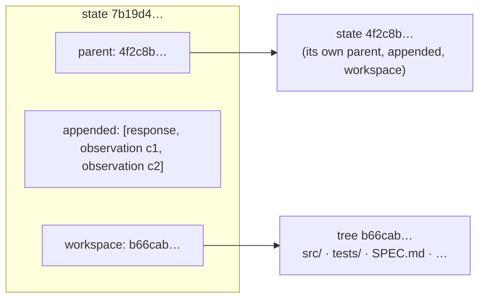
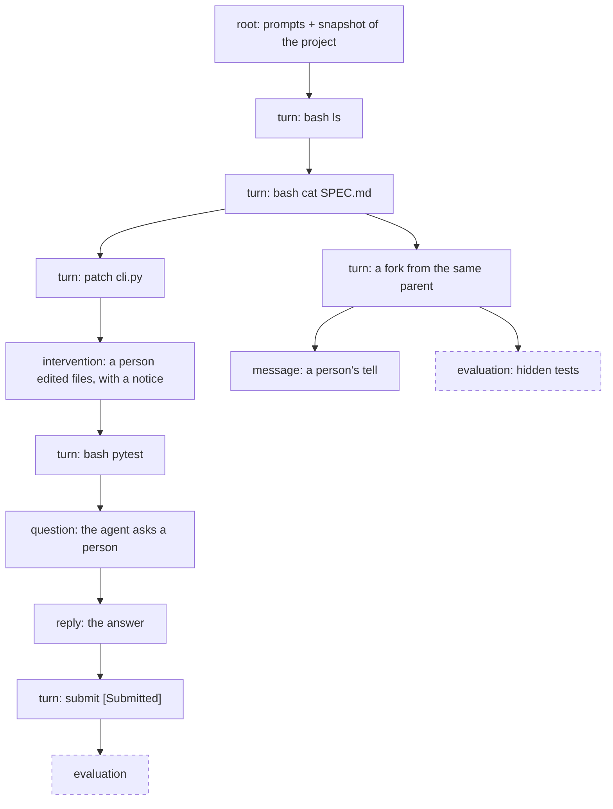
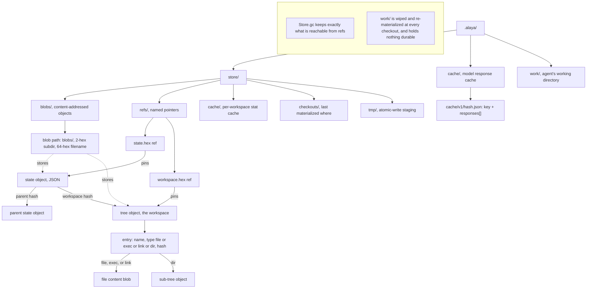

# Trajectory and cache schema

`Alaya.Trajectory` records an agent's run as a tree of immutable states in a content-addressed
store, and `Alaya.Cache` records every model response the run drew. Together they make a run
something you can branch, replay, evaluate, intervene in, and read back.

## 1. States

A **state** is a point in a run: the log up to that point, and the workspace at that point. The
workspace is recorded as a **snapshot**: the content of the directory the agent acts in, written
into the content-addressed store as a tree of files and named by its hash.

### The state object

A state is stored as one object with three parts:

- the hash of its **parent** state, or none for a root;
- the events it **appends** to the parent's log;
- the hash of its workspace snapshot, `workspace`.

The object is itself content-addressed: its hash covers those three parts, so a state's hash
names its whole history and its files, and nothing under a hash ever changes. The full log at a
state is the concatenation of `appended` along the path from the root (`logOf`), and the
workspace at a state is its `workspace`. A run is therefore a **tree** of states, and it only grows:
continuing from any state adds a child, and the original branch is untouched.

*A state object, and what its hash covers.*



### Kinds of state

Every state is one of seven kinds. The kind says what created the state and therefore what its
`appended` and `workspace` hold. Four kinds come from the `alaya` commands a person runs (`commit`,
`tell`, `reply`, `eval`); `root` comes from `root`; `turn` and `question` come from the agent,
driven by `resume` or `step`.

| Kind | Created by | `appended` | `workspace` |
| --- | --- | --- | --- |
| `root` | `alaya root` | the agent's opening prompts | the project as given |
| `turn` | one model turn | the response, and the observation of each call it made | the workspace after those calls ran |
| `question` | a model turn whose call asked a person | the response, and the observations of the calls before the ask | the workspace after those calls ran |
| `reply` | `alaya reply` | one observation: the person's answer to the question, verbatim | the parent's |
| `intervention` | `alaya commit` | nothing, or one notice when `--tell` is given | the directory the person edited |
| `message` | `alaya tell` | one notice carrying the person's text | the parent's |
| `evaluation` | `alaya eval` | nothing | the parent's plus the test overlay |

Two kinds constrain what may follow them. A `question` waits: only `reply` may be its child until
one exists. An `evaluation` is a leaf: its workspace holds tests the agent must never see, so
nothing continues from it.

Besides the three parts, a state carries what the run needs to continue and what a reader wants
to know: the container `image?`, set on the root and inherited; a `note?` of provenance (the model spec for a turn, the task for a root, the note for
an intervention); the `outcome?` when the state ended the run; the `question?` a `question` is
waiting on; the `intervention?` record behind a notice; and the `evaluation?` verdict.

*A trajectory: one run with a fork, an intervention, a question, and two evaluations.*



## 2. Draws, forks, and replay

The model cache (§7) stores the draws of a request as a sequence. When the
trajectory continues from a state that already has `n` children of kind `turn` or `question`, it
asks for draw `n`: `nextN (n+1)` returns the recorded draws and exactly one new one. So a branch
already recorded replays deterministically, a new continuation is always a fresh sibling, and an
interrupted run resumes from its cache without re-billing. Children a person makes — `reply`,
`message`, `intervention` — and evaluations do not count, because they asked the model nothing,
and counting them would push the next continuation past a draw the cache holds.

The cache and the states hold responses for different reasons. The cache holds every draw of a
request, indexed, which is what tells a continuation which draw is next and lets an interrupted
turn resume without a new request. A state holds the response its turn used, as part of the
record. A response used by a state is therefore in both places, by design.

A **turn** is one sample plus the acts that follow it until the agent's `next` wants to sample
again, stops, or asks a person. The trajectory materializes the parent's workspace, samples from
`agent.view log` with `agent.tools`, then follows directives: each `act` snapshots the working
directory after it, so the state's workspace is exactly the one its last observation left.

## 3. People in the tree

`commit HASH DIR` records a hand-edited directory as an `intervention`; with
`--tell TEXT` it also appends a user turn in a fixed envelope naming the changed paths and
carrying the text verbatim, so the model can tell a notice from the task and from tool output.
`tell HASH TEXT` appends the same notice without a workspace change. Both are recorded as
`Event.message`, which every view passes through unchanged.

An agent that offers a tool whose `next` returns `ask` produces a `question` state: the
calls before the ask ran, the ones after it did not, and `resume`, `step`, `commit`, and `tell`
refuse the state until `reply HASH TEXT` records the answer as the observation of the asking
call. Answering again makes a sibling — a fork on the answer. `waiting` lists questions no child
has answered; `resume` and `step` exit with status 3 at a question and 0 at an outcome, and
`--json` makes each state line one object, so a program can drive the loop.

## 4. Evaluation

`eval HASH --command C` checks the state's workspace out, applies an overlay —
a directory copied over it, or a unified diff whose touched files are first restored from the
root snapshot so the agent's edits to tests cannot survive, then applied with `patch(1)` on the
host — runs the command
through the trajectory's executor (in the pinned container, if any), and records the verdict as
an `evaluation` **leaf**: exit code, elapsed time, output truncated to 20 000 characters, and the
overlay's content hash. Nothing continues from it. Re-evaluating the same state, command, and
overlay returns the existing node unless `--force`.

## 5. On disk

The data directory (`--data D`, default `.alaya`) holds everything one set of runs needs:

| Path | Contents |
| --- | --- |
| `D/store/blobs/<2 hex>/<64 hex>` | every object, addressed by the SHA-256 of its bytes: state objects, tree objects, file contents, link targets, test patches |
| `D/store/refs/state.<hex>` | pins a state object; the set of these *is* the forest |
| `D/store/refs/workspace.<hex>` | pins a workspace tree, so `gc` keeps it |
| `D/store/cache/`, `D/store/checkouts/` | the snapshot stat cache and the record of what was last materialized where; performance only |
| `D/store/tmp/` | staging for atomic writes (write, then rename) |
| `D/cache/v1/<hash>.json` | model response cache entries (§7) |
| `D/work/` | the working directory; wiped and re-materialized at every checkout, holds nothing durable |

A workspace is a git-style Merkle tree: a **tree object** is the JSON array of its entries
`{"name", "type": "file"|"exec"|"link"|"dir", "hash"}`, sorted by name so its serialization is
canonical; a file entry's hash addresses the content blob, a directory's the sub-tree. Unchanged
subtrees keep their address across snapshots, so a snapshot costs only the objects along changed
paths and diffing skips identical subtrees. Snapshots are stat-cached, hashed in parallel,
record symlinks and executable bits, and can ignore paths. Materializing is incremental against
the recorded checkout and, by default, re-captures the destination first (`verify`), because the
record goes stale the moment the agent writes; without that, a fork would start from the
abandoned branch's files.

`Store.gc` deletes every blob unreachable from a ref. `rm HASH` deletes a subtree by dropping its
`state.` refs, re-pinning `workspace.` refs from the survivors, and collecting.

*What is on disk: the data directory, and how state and tree objects reference each other in the content-addressed store.*



## 6. The state object

A state object is compact JSON. Field order is canonical (sorted keys), so equal states have
equal hashes.

| Field | Type | Meaning |
| --- | --- | --- |
| `v` | 1 | schema version; a reader refuses any other |
| `parent` | hex or null | the parent state |
| `workspace` | hex | the workspace tree |
| `kind` | string | one of the kinds in §1 |
| `appended` | array of events | what this state adds to the parent's log |
| `outcome` | `{status, submission}` or null | when this state ended the run |
| `note` | string or null | provenance |
| `image` | string or null | the pinned container image, inherited |
| `evaluation` | object or null | `{command, returncode, elapsed_ms, output, tests}` on an evaluation |
| `intervention` | object or null | `{message, changed: ["M path", "+ path", "- path", …]}` on a state that carried a notice |
| `question` | object or null | `{call_id, text}` on a waiting state |

An **event** is one of:

```json
{"type": "message", "message": {"role": "system"|"user", "content": "…"}}
{"type": "message", "message": {"role": "assistant", "content": …, "reasoning": …, "tool_calls": [call…]}}
{"type": "message", "message": {"role": "tool", "tool_call_id": "…", "content": <json>}}
{"type": "response", "response": {"content", "tool_calls": [call…], "reasoning", "finish_reason", "usage": {"input", "output", "total"}}}
{"type": "observation", "call_id": "…", "content": <json>}
```

where a **call** is `{"id", "name", "arguments": <json>, "invalid_arguments": string|null}` —
`invalid_arguments` keeps the raw text when the provider's arguments were not JSON, so the
dialogue sent back to the model is byte-identical to what it produced. An observation's
`content` is whatever the agent's `act` returned; the trajectory never reads it.

## 7. The model cache entry

`D/cache/v1/<hash>.json`, where `hash` is Lean's generic hash of the cache key:

```json
{
  "version": 1,
  "key": "<compress {model: <identity>, structured_output: <mode>, request: <Request.toJson>}>",
  "responses": [
    {"content": …, "tool_calls": [call…], "usage": {…}, "finish_reason": …, "reasoning_content": …},
    …
  ]
}
```

`responses[i]` is draw `i` of that request under that model identity. The stored key is checked
against the file name on load, and a corrupt entry reads as empty and is replaced on the next
successful sample. The key contains the full
request, so anything that changes what the model is sent — the view, the tool list, the model
identity including options such as reasoning echo — changes the key, and a forest recorded under
one will not replay under another.

## 8. Commands

```
alaya root TASK PROJECT [--image IMAGE]          create a root from a project directory
alaya root TASK --image IMAGE --path PATH        …or from a path inside the image
alaya resume HASH --model P:M                    grow one continuation until it ends or asks
alaya step   HASH --model P:M                    advance exactly one turn
alaya eval   HASH --command C [--tests DIR | --test-patch FILE | --tests-from-image PATH]
alaya commit HASH DIR [-m NOTE] [--tell TEXT]    record a hand-edited workspace as a child
alaya tell   HASH TEXT                           send the agent a message, as a child
alaya reply  HASH TEXT                           answer the question a state is waiting on
alaya waiting                                    list every unanswered question
alaya checkout HASH DIR                          materialize a state's workspace into DIR
alaya tree                                       show the whole forest
alaya show HASH [--view]                         metadata, the log, and optionally the view
alaya diff A B                                   workspace changes between two states
alaya html [FILE] [--hide DIR]                   write the forest as one self-contained page
alaya rm HASH                                    delete a subtree and reclaim blobs
```

Every command takes `--data D` and `--json` where it prints states. `root` takes `--image`,
`--container-user`, and `--network`; `resume` and `step` take `--model`,
`--temperature`, `--echo-reasoning`, `--network`, and the DGX flags `--url`/`--port`; `eval`
takes `--timeout` (default 900 s) and `--force`. The image is resolved to a digest at `root`
and recorded; `resume` uses it and refuses an `--image` that resolves to anything else.
A container runs with **no network** unless `--network` names one (`--network bridge` is
Docker's default network): an agent with network access can go looking for its own reference
solution, so an image should carry what a task legitimately needs.

Exit status: 0 when a run ended, 3 when it stopped at a question, 1 on error. Concurrent runs
need separate data directories: the work directory and the cache are not shared safely.

## 9. Invariants

- A state's hash covers its parent, its appended events, and its workspace; nothing under a
  hash ever changes.
- `logOf state` is the concatenation of `appended` from the root; the request the model was
  sent to produce a turn is `agent.view (logOf parent)` with `agent.tools`.
- Continuing from a state with `n` turn-or-question children asks for draw `n`; other children
  never consume a draw.
- A state's workspace is the snapshot taken after its last act; an evaluation's is the parent's
  plus the overlay, and nothing continues from it.
- A waiting state grows only by `reply`.
- The trajectory reads no observation's content and knows no tool's name.
